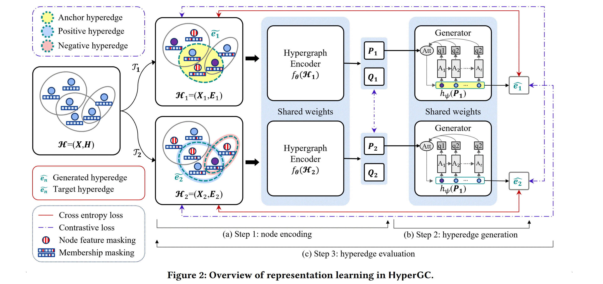

# HyperGC

**HyperGC: Learning Hypergraph Representations via Full Hyperedge Reconstruction and Contrastive Evaluation**


This repository provides the official implementation of **HyperGC**, a self-supervised hypergraph representation learning framework that integrates **full hyperedge reconstruction** with **contrastive evaluation**.


---

## Overview



HyperGC addresses two fundamental challenges in generative hypergraph representation learning:


1. **Partial reconstruction bias**: Existing methods reconstruct only a subset of nodes in each hyperedge, limiting their ability to model real-world hyperedge formation.
2. **Negative-sampling sensitivity**: Discrimination-based evaluation heavily depends on the quality of negative samples.


To overcome these challenges, HyperGC introduces:
- **Progressive full hyperedge reconstruction** with a dynamic target cross-entropy (DTCE) loss.
- **Contrastive evaluation** across augmented views without handcrafted negative samples.


---


## Requirements

Python 3.9.18, PyTorch 1.11.0 (CUDA 11.3), and PyTorch Geometric 2.0.4 are required.
Detailed package versions are provided in `requirements.txt`. 


---


## Data Preparation
The datasets used in this paper can be downloaded at https://drive.google.com/file/d/103beI-yEXrxCz_nyWtS2ogB7dzlpR0-1/view?usp=sharing.
Please download `data.zip` and extract it under the `data/` directory as follows:
```
HyperGC/
├── data/ # Hypergraph datasets (extracted from data.zip)
├── HyperGC/ 
│ ├── dataset.py
│ ├── evaluation.py
│ ├── layers.py
│ ├── loader.py
│ ├── model_loss.py  # variant of HyperGC model (V3)
│ ├── model_partial.py # variant of HyperGC model (V1,V2)
│ ├── models.py # HyperGC (V4)
│ └── utils.py
├── ablation_baseline.py # variant of HyperGC model (V1,V2)
├── ablation_loss.py  # variant of HyperGC model (V3)
├── main.py 
├── config.yaml
├── requirements.txt
└── README.md
``````

---
## Usage

### Node Classification Task (Table 3)
`sh bash/node_cls_main_task.sh`
### Hyperedge Prediction Task (Table 10) 
`sh bash/hyperedge_pred_main_task.sh`
### Community Detection Task (Table 11)
`sh bash/node_clus_main_task.sh`